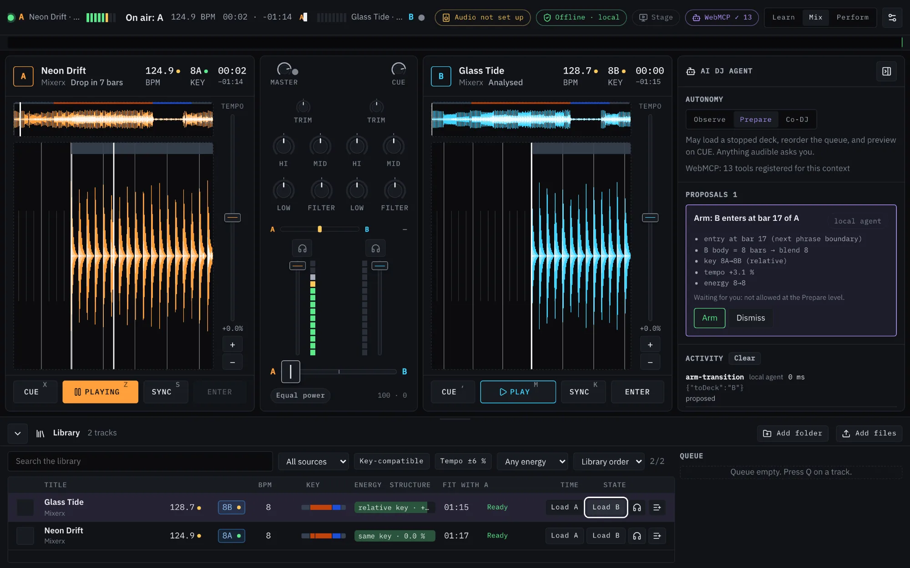

# Mixerx

**Two decks. A live visual stage. Your music, on your machine.**

Mixerx is a browser-based DJ instrument for learning to mix, building a set, and shaping
the visuals around it. Bring your own tracks or generate the built-in demo pair, blend
them on the Console, and send music-reactive visuals to a separate audience display.

The AI DJ agent is optional. Local rules can suggest the next move; a compatible
WebMCP agent can work with the same tools. You choose how much it may do.

[Open the app](https://mixerx.aiooup.chatgpt.site) ·
[Explore the introduction](https://mixerx.aiooup.chatgpt.site/mixerx/) ·
[Watch the demo on YouTube](https://youtu.be/OTJsOIhV-zM)

The hosted app and introduction page are publicly accessible.



## What you can do

- **Mix two tracks:** real waveforms, tempo and sync, EQ, filters, headphone cueing,
  crossfader curves, hot cues, loops, beat jumps, and sampler pads.
- **Learn by doing:** a guided phrase-entry lesson with beat-grid confirmation and
  feedback from the actual mix.
- **Organize your music:** local file and folder import, track analysis, search,
  compatibility filters, and a queue.
- **Run the show:** a WebGPU Stage with Classic, Simple, and Cinematic looks,
  music-driven transitions, presets, crowd overlays, and blackout controls.
- **Work with an agent:** structured musical suggestions, permission-based actions,
  confirmation cards, and undo for supported changes.
- **Use your setup:** configurable audio routing, optional MIDI input, keyboard
  shortcuts, and a command palette.

## Optional audio download

Don't have tracks yet? [Download the optional audio files from Google Drive](https://drive.google.com/file/d/191qujoklRwaGgxNER8JR_OpkSM36kxZH/view?usp=drive_link)
for a quicker start and more music to explore in Mixerx. After downloading, use
**Add files** or **Add folder** in the Library to import the audio.

This download is **not required**. You can bring your own tracks or choose
**Load demo tracks** to generate the built-in demo pair without downloading audio.

## Run locally

Use Node.js **22.12 or newer** and npm. The repository declares its npm version in
[package.json](package.json).

```bash
npm ci
npm run dev -- --host 127.0.0.1
```

Open [Mixerx on localhost](http://localhost:4187). In the Library, choose **Load demo
tracks**, **Add files**, or **Add folder**. Start with **Learn** for the guided mix,
or switch to **Mix** to explore. Open **Audio Setup** before relying on separate
master and headphone outputs.

The introductory website is available at
[localhost:4187/mixerx/](http://localhost:4187/mixerx/). It has a
[separate build](mixerx/README.md).

To package the app and introduction page together for Sites, run `npm run build:site`.
This creates the deployment files in `dist/` without publishing them.

## Browser and hardware

Mixerx targets desktop and landscape-tablet use. The Console requires Web Audio;
the visual Stage requires WebGPU. Folder permissions, output-device selection,
MIDI, picture-in-picture, and multi-display placement depend on browser support
and attached hardware. The interface reports unavailable capabilities.

WebMCP is optional and requires a compatible browser or agent host. A narrow phone
screen is not a supported mixing surface.

## Privacy, precisely

The Console and Stage process audio locally, with no application-owned cloud service,
telemetry, or CDN assets. Selected audio files are not uploaded; decoded audio stays
in memory and library metadata is saved in this browser.

An external WebMCP agent can read track titles, artists, and analysis summaries.
Its provider may process that information outside Mixerx. The separate introduction
page loads its YouTube demo only after you activate it. See
[Privacy and data](docs/privacy.md) for these boundaries.

## Project status

Mixerx is an **alpha**. Analysis results are estimates, not certified BPM, key, or
downbeat annotations. Tempo changes also change pitch; pitch-preserving keylock is
not implemented. Test your browser, audio routing, and displays before a performance.

The repository records the origin of its visual assets, but redistribution
permission for some supplied artwork is not documented. Review
[Third-party notices](THIRD-PARTY-NOTICES.md) before redistributing a build.

## Documentation and contributions

- [Documentation](docs/README.md) — product guides and technical references.
- [Contributing](CONTRIBUTING.md) — setup, quality checks, and contribution terms.
- [Architecture](docs/architecture.md) — how the instrument fits together.
- [Testing](docs/testing.md) — reproducible checks and private-corpus limitations.
- [Repository contents](docs/repository.md) — tracked sources, ignored files, and release checks.

## License

Project code is available under [AGPL-3.0-or-later](LICENSE). See [NOTICE](NOTICE)
for the maintainer's commercial licensing option. Third-party software and artwork
retain their own terms; the project license does not establish rights to those assets.
